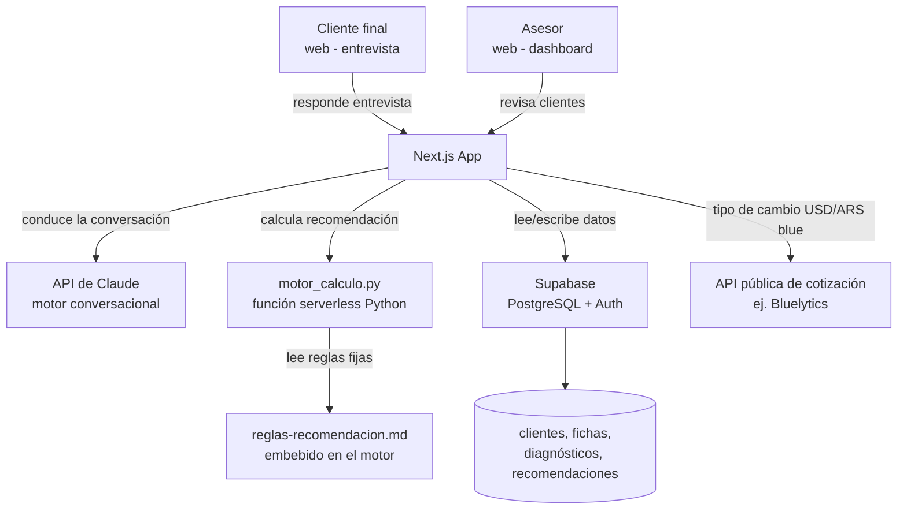

# Arquitectura técnica

---

## Stack seleccionado

| Capa | Tecnología | Justificación |
|------|-----------|---------------|
| Framework | Next.js 14 (App Router) | React full-stack, Server Components, se integra bien con Supabase y con llamadas server-side a la API de Claude. Despliegue zero-config en Vercel. |
| Base de datos | Supabase (PostgreSQL + Auth + Storage) | Base de datos + autenticación en un solo servicio, capa gratuita generosa — coherente con "sin presupuesto de terceros" de `business.md`. |
| Motor de cálculo | Python (`motor_calculo.py` existente), como función serverless en Vercel | Se mantiene en Python tal cual está hoy — reduce riesgo de introducir bugs al portar la lógica de `reglas-recomendacion.md`. Vercel soporta funciones serverless en Python nativamente, así que no hace falta un segundo proveedor de hosting: vive en `api/motor-calculo.py` dentro del mismo repo/deploy. |
| Motor conversacional (entrevista) | API de Claude (Anthropic) | Conduce la entrevista guiada al cliente final siguiendo el guion y las reglas de `instrucciones-sistema.md` (una pregunta por turno, manejo de ambigüedad, tono cercano). Se llama desde route handlers de Next.js, nunca desde el cliente (la API key no se expone al navegador). |
| Autenticación | Supabase Auth | Login del asesor (email/password o magic link). El cliente final no necesita cuenta: accede a su entrevista con un enlace único de un solo uso generado por el asesor (ver `data-model.md`). |
| Estilos | Tailwind CSS + shadcn/ui | Coherente con la paleta y los componentes definidos en `design-system.md`; velocidad de desarrollo sin sacrificar personalización de color/tipografía. |
| Despliegue | Vercel | Next.js y la función Python del motor de cálculo se despliegan juntos, sin infraestructura propia que mantener. |

---

## Diagrama de componentes



---

## Estructura de carpetas

```
src/
├── app/
│   ├── (dashboard)/        → Rutas del asesor, protegidas por Supabase Auth
│   │   └── clientes/       → Listado y detalle de clientes (ficha/diagnóstico/recomendación)
│   ├── entrevista/[token]/ → Ruta pública de la entrevista, acceso por enlace único
│   └── api/
│       ├── entrevista/     → Route handlers que orquestan la conversación con Claude
│       └── motor-calculo/  → Función Python serverless (motor_calculo.py migrado tal cual)
├── components/
│   ├── ui/                 → Componentes base (shadcn/ui)
│   ├── entrevista/         → Componentes específicos del flujo de entrevista
│   └── dashboard/          → Componentes específicos del panel del asesor
├── lib/
│   ├── supabase/           → Cliente Supabase y helpers
│   ├── claude/             → Cliente de la API de Claude y prompt del sistema (basado en
│   │                          `instrucciones-sistema.md`)
│   ├── alertas/            → Lógica pura de la vigilancia de mercado (detectarEventos,
│   │                          clientesAfectados, mensajeInterno, construirCorreoAlerta,
│   │                          construirCorreoInterno). Imports relativos con extensión .ts a
│   │                          propósito -- también la consume supabase/functions/revision-diaria
│   │                          (Deno), que no resuelve el alias @/ ni imports sin extensión.
│   └── utils/               → Funciones utilitarias (formateo de moneda, fechas, etc.)
├── hooks/                  → Custom hooks de React
└── types/                  → Tipos TypeScript compartidos

supabase/
└── functions/
    └── revision-diaria/    → Revisión diaria de mercado, como Edge Function (Deno). Orquesta
                               src/lib/alertas por import relativo -- no reimplementa su lógica.
                               La dispara pg_cron (ver "Integraciones externas" y config.toml).

api/
└── motor-calculo.py        → Función serverless Python (lógica de reglas-recomendacion.md)

docs/                       → Documentación del proyecto (ver CLAUDE.md)
changelog/                  → Registro de cambios
mejoras/                    → Ideas futuras no implementadas
```

---

## Estrategia de autenticación

- **Asesor:** login con Supabase Auth (email/password o magic link). Todas las rutas bajo
  `(dashboard)/` requieren sesión activa. Un solo asesor en esta fase (ver `business.md` →
  Restricciones), pero el modelo de datos ya asocia clientes a un `asesor_id` para no cerrar la
  puerta a soportar más de uno el día de mañana.
- **Cliente final:** sin cuenta ni contraseña. El asesor genera un enlace único (`/entrevista/
  [token]`) por cliente, con token de un solo uso vinculado a ese cliente en la base de datos.
  El enlace expira una vez completada la entrevista o tras un tiempo definido, para que no quede
  reutilizable indefinidamente.

---

## Integraciones externas

- **API de Claude (Anthropic):** conduce la entrevista conversacional con el cliente final,
  siguiendo el guion y las reglas de tono/ambigüedad de `instrucciones-sistema.md`. Se llama
  exclusivamente desde el servidor (route handlers de Next.js) — la clave nunca se expone al
  cliente.
- **API pública de cotización (ej. Bluelytics u otra fuente equivalente del dólar blue):** para
  la conversión de moneda en vivo cuando el objetivo del cliente está en una moneda distinta a
  su flujo (regla de `reglas-recomendacion.md` §6). Se cita siempre con fecha y fuente en el
  registro de recomendación; si la llamada falla, el cálculo que depende de ella queda
  bloqueado — nunca se estima un valor.
- **Supabase:** base de datos, autenticación y storage (si se necesita exportar PDF/Word más
  adelante, ver `prd.md` → SHOULD).
- **Yahoo Finance (API pública `query1.finance.yahoo.com/v8/finance/chart`, sin clave):** cierres
  diarios del S&P 500 (`^GSPC`) para la capa de vigilancia de mercado
  (`supabase/functions/revision-diaria`). Es una API no oficial de Yahoo, sin SLA — si falla, la
  función no genera eventos ese día (nunca estima un cierre), mismo criterio que la cotización
  del dólar blue.
- **Composio (`backend.composio.dev`, API key):** puente hacia la acción externa de
  `supabase/functions/revision-diaria` — mandar el correo de aviso (al asesor siempre, al
  cliente si `avisar_cliente = true`) a través de una cuenta de Gmail conectada en Composio,
  ejecutando `GMAIL_SEND_EMAIL` vía `POST /api/v3.1/tools/execute/{tool_slug}`. No es SMTP
  directo: no hace falta contraseña de aplicación de Gmail, solo `COMPOSIO_API_KEY` (secreta),
  `COMPOSIO_GMAIL_ACCOUNT_ID` y `COMPOSIO_GMAIL_ENTITY_ID` (identificadores de la conexión, no
  son secretos), configurados como secrets de Supabase (`supabase secrets set`), no en
  `.env.local`. La API key requiere permiso `tool_execution` con escritura ("Full access" al
  crearla), y Gmail tiene que estar conectado en **Auth Configs del mismo proyecto de Composio**
  que esa key — un proyecto no ve las cuentas conectadas de otro (a esto se lo llevó media tarde
  de prueba y error, ver changelog 2026-08-29). Yahoo Finance es de solo lectura y no pasa por
  Composio — Composio se usa únicamente para la acción de escritura hacia un servicio externo
  (mandar el correo).
- **pg_cron / Supabase Edge Functions:** `pg_cron` dispara `revision-diaria` una vez al día con
  un `POST` HTTP (vía `net.http_post`, extensión `pg_net`). Como no hay un usuario logueado
  detrás de esa llamada, la función no verifica JWT de Supabase Auth (`verify_jwt = false` en
  `supabase/config.toml` para esta función) — en su lugar valida un secreto propio,
  `CRON_SECRET`, en la cabecera `Authorization: Bearer <CRON_SECRET>`. El job de `pg_cron` en sí
  todavía no está creado (ver `mejoras/backlog.md`); por ahora la función se invoca a mano.

---

## MCPs del proyecto

| Servidor | Alcance | Para qué se usa | Variables necesarias |
|----------|---------|-----------------|----------------------|
| supabase | project | Consultar y modificar el esquema, aplicar migraciones, depurar la base de datos sin salir del editor | — (OAuth vía `/mcp`, sin token en el repo) |

---

## Estrategia de despliegue

- **Repositorio:** rama `main` como fuente de verdad; ramas de feature con PR hacia `main`.
- **Entornos:** desarrollo local (`pnpm dev` + proyecto Supabase de desarrollo) y producción en
  Vercel (proyecto Supabase de producción). Sin entorno de staging separado por ahora — uso
  interno, un solo asesor, bajo riesgo de romper algo para terceros.
- **Variables de entorno:** `ANTHROPIC_API_KEY`, `SUPABASE_URL`, `SUPABASE_ANON_KEY`,
  `SUPABASE_SERVICE_ROLE_KEY` (solo en servidor) — referenciadas en `.env.example`, valores
  reales en `.env.local` / variables de entorno de Vercel, nunca commiteadas.

---

## Decisiones técnicas relevantes

### 2026-08-15 — Mantener el motor de cálculo en Python en vez de migrarlo a TypeScript
**Contexto:** `motor_calculo.py` ya implementa `reglas-recomendacion.md` 1:1 y está validado con
casos reales (Maribel, Anali). Migrarlo a TypeScript implicaba reescribir toda la lógica de
cálculo desde cero.
**Opciones consideradas:** (1) portar todo a TypeScript para que viva en el mismo runtime que el
resto de la app, (2) mantenerlo en Python como función serverless separada.
**Decisión:** se mantiene en Python, desplegado como función serverless en Vercel junto al resto
del proyecto — evita reescribir lógica ya probada y evita también gestionar un segundo proveedor
de hosting.
**Consecuencias:** el repo mezcla dos runtimes (Node/TypeScript para la app, Python para el
motor). La comunicación entre ambos es una llamada HTTP interna desde un route handler de
Next.js a `api/motor-calculo.py`.

### 2026-08-15 — Acceso del cliente final sin cuenta, por enlace único
**Contexto:** el cliente final solo necesita completar una entrevista puntual, no volver a
loguearse en el futuro (al menos en esta fase, sin historial de re-entrevistas planificado como
MUST).
**Opciones consideradas:** (1) cuenta completa con Supabase Auth para el cliente, (2) enlace de
un solo uso con token, sin contraseña.
**Decisión:** enlace único por token, generado por el asesor.
**Consecuencias:** más simple de implementar y de usar para el cliente (sin fricción de
registro), pero si más adelante se necesita que el cliente vuelva a ver su propio resultado
después de que el token expiró, hay que diseñar esa reentrada (ej. reenvío de un nuevo enlace).
