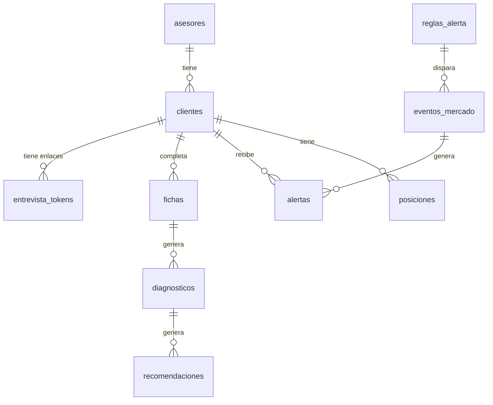

# Modelo de datos

---

## Entidades principales

### auth.users (gestionada por Supabase Auth)
Tabla nativa de Supabase. Un único registro por ahora: el asesor. No se modifica directamente.

### asesores
Extensión de `auth.users` con datos propios de la app. Un solo registro en esta fase, pero
existe como tabla separada para no cerrar la puerta a soportar más de un asesor más adelante
(ver `architecture.md` → Estrategia de autenticación).

| Campo | Tipo | Descripción |
|-------|------|-------------|
| id | uuid (FK → auth.users) | Identificador del asesor |
| nombre | text | Nombre del asesor |
| created_at | timestamptz | Fecha de alta |

### clientes
Un cliente final del asesor.

| Campo | Tipo | Descripción |
|-------|------|-------------|
| id | uuid (PK) | Identificador del cliente |
| asesor_id | uuid (FK → asesores) | Asesor dueño de este cliente |
| nombre | text | Nombre del cliente |
| email | text (nullable) | Contacto opcional, no se usa para login |
| estado | text | `pendiente` \| `entrevista_completa` |
| avisar_cliente | boolean | Si recibe correo cuando una alerta de mercado lo afecta (default `false`, ver `scripts/revision.ts`) |
| suspendido | boolean | Excluye al cliente de `clientesAfectados` aunque tenga posición y perfil coincidente (default `false`) |
| created_at | timestamptz | Fecha de alta |

### entrevista_tokens
Enlace único de acceso a la entrevista, sin necesidad de cuenta (ver `architecture.md` →
Estrategia de autenticación).

| Campo | Tipo | Descripción |
|-------|------|-------------|
| id | uuid (PK) | Identificador del token |
| cliente_id | uuid (FK → clientes) | Cliente al que pertenece el enlace |
| token | text (único) | Valor incluido en la URL `/entrevista/[token]` |
| expires_at | timestamptz | Vencimiento del enlace |
| used_at | timestamptz (nullable) | Momento en que se completó la entrevista; null mientras está pendiente |

### fichas
Las 6 variables recolectadas en la entrevista (ver `plantilla-entrevista.md` /
`instrucciones-sistema.md` §2). Una ficha por cliente; si se reentrevista, se versiona con
`created_at` en vez de sobreescribir (ver `prd.md` → SHOULD: historial).

| Campo | Tipo | Descripción |
|-------|------|-------------|
| id | uuid (PK) | Identificador de la ficha |
| cliente_id | uuid (FK → clientes) | Cliente al que pertenece |
| edad | int | Perfil |
| dependientes | text | Perfil |
| situacion_laboral | text | Perfil |
| estabilidad_laboral | text | Perfil — determina el mínimo de fondo de emergencia (3 vs. 6 meses) |
| objetivo_descripcion | text | Objetivo |
| objetivo_monto | numeric | Objetivo |
| objetivo_moneda | text | `ARS` \| `USD` (u otra) — dispara conversión si difiere del flujo |
| objetivo_plazo_meses | int | Objetivo |
| objetivo_prioridad | text (nullable) | Objetivo, si hay más de una meta |
| ingresos_netos_mensuales | numeric | Ingresos y gastos |
| ingresos_estimado | boolean | Marca `(estimado)` |
| gastos_fijos_mensuales | numeric | Ingresos y gastos |
| gastos_estimado | boolean | Marca `(estimado)` |
| deuda_saldo | numeric (nullable) | Deudas |
| deuda_cuota_mensual | numeric (nullable) | Deudas |
| deuda_tasa_interes | numeric (nullable) | Deudas |
| deuda_estimado | boolean | Marca `(estimado)` |
| ahorro_actual_monto | numeric | Ahorro e inversión |
| ahorro_actual_liquidez | text (nullable) | Ahorro e inversión |
| ahorro_estimado | boolean | Marca `(estimado)` |
| fondo_emergencia_meses | numeric | Ahorro e inversión |
| perfil_riesgo_declarado | text | `conservador` \| `moderado` \| `dinamico` — nunca estimado ni texto libre (regla fija) |
| notas_cualitativas | text (nullable) | Motivación y contexto que no entra en el cálculo |
| created_at | timestamptz | Fecha de la entrevista |

### diagnosticos
Salida del bloque de diagnóstico (`instrucciones-sistema.md` §3) — solo descriptivo, nunca
recomienda nada.

| Campo | Tipo | Descripción |
|-------|------|-------------|
| id | uuid (PK) | Identificador del diagnóstico |
| ficha_id | uuid (FK → fichas) | Ficha sobre la que se calculó |
| tasa_ahorro | numeric | (ingresos − gastos − cuota deuda) / ingresos |
| porcentaje_camino_recorrido | numeric | ahorro actual / monto objetivo |
| proyeccion_acumulada | numeric | Acumulado proyectado al plazo, sosteniendo la tasa actual |
| gap | numeric (nullable) | Proyección vs. objetivo; null si falta un dato bloqueante (ej. tipo de cambio no confirmado) |
| gap_pendiente_motivo | text (nullable) | Por qué el gap no se pudo calcular, si aplica |
| created_at | timestamptz | Fecha del cálculo |

### recomendaciones
Salida completa del motor de cálculo (`motor_calculo.py` según `reglas-recomendacion.md`) — el
registro técnico que audita el asesor.

| Campo | Tipo | Descripción |
|-------|------|-------------|
| id | uuid (PK) | Identificador de la recomendación |
| diagnostico_id | uuid (FK → diagnosticos) | Diagnóstico sobre el que se calculó |
| etapa_prioridad | text | `fondo_emergencia` \| `deuda_cara` \| `invertir` |
| fondo_emergencia_requerido_meses | numeric | Según estabilidad laboral (§1 de `reglas-recomendacion.md`) |
| tipo_cambio_usado | numeric (nullable) | Si el objetivo está en otra moneda |
| tipo_cambio_fecha | timestamptz (nullable) | Fecha de la búsqueda en vivo |
| tipo_cambio_fuente | text (nullable) | Fuente citada |
| aporte_necesario | numeric | gap / plazo restante |
| aporte_maximo_sostenible | numeric | Excedente − colchón − aporte pendiente a fondo de emergencia |
| diferencia | numeric | aporte_necesario − aporte_maximo_sostenible |
| viable | boolean | Si el aporte necesario ≤ el sostenible |
| distribucion_renta_fija | numeric | % recomendado |
| distribucion_liquidez | numeric | % recomendado |
| distribucion_renta_variable | numeric | % recomendado |
| alternativas | jsonb | Las 3 alternativas cuantificadas + la 4ª señalada sin cuantificar (§4) |
| supuestos | jsonb | Supuestos usados (ej. rendimiento asumido si se pidió el escenario opcional) |
| created_at | timestamptz | Fecha del cálculo |

### observaciones_mercado
Valor observado de una clase de activo en una fecha. Capa de vigilancia de mercado, por encima
del resto del modelo — no depende de `clientes` ni de `fichas`.

| Campo | Tipo | Descripción |
|-------|------|-------------|
| id | uuid (PK) | Identificador de la observación |
| clase | text | Clase de activo observada (ej. `renta_variable`) |
| fecha | date | Fecha de la observación — único junto con `clase` |
| valor | numeric | Valor/índice observado |
| created_at | timestamptz | Fecha de carga |

### reglas_alerta
Umbral configurado para disparar una alerta, en tanto por uno (`0.03` = 3 %). El umbral es una
magnitud, no una dirección fija: dispara tanto si la clase sube como si baja esa magnitud o más
en la ventana (ver `detectarEventos` en `src/lib/alertas/detectar-eventos.ts` — cambio posterior
al seed original, que solo contemplaba caídas).

| Campo | Tipo | Descripción |
|-------|------|-------------|
| id | uuid (PK) | Identificador de la regla |
| clase | text | Clase de activo a la que aplica |
| perfil_riesgo | text | `conservador` \| `moderado` \| `dinamico` |
| ventana_dias | int | Ventana de días sobre la que se mide la variación |
| umbral | numeric | Magnitud mínima de variación (subida o baja) que dispara el evento, en tanto por uno (`0 < umbral ≤ 1`) |
| created_at | timestamptz | Fecha de alta |

### eventos_mercado
Disparo efectivo de una `regla_alerta`: la variación medida en `[desde, hasta]` superó el umbral.

| Campo | Tipo | Descripción |
|-------|------|-------------|
| id | uuid (PK) | Identificador del evento |
| regla_id | uuid (FK → reglas_alerta) | Regla que se disparó |
| desde | date | Inicio de la ventana medida |
| hasta | date | Fin de la ventana medida — único junto con `regla_id` |
| variacion | numeric | Variación medida en tanto por uno (negativa si es una caída, positiva si es una subida) |
| created_at | timestamptz | Fecha de detección |

### alertas
Instancia de un `evento_mercado` aplicada a un cliente concreto (después de aplicar las
exclusiones de `src/lib/alertas/clientes-afectados.ts`: suspendido, sin análisis, perfil
distinto al de la regla).

| Campo | Tipo | Descripción |
|-------|------|-------------|
| id | uuid (PK) | Identificador de la alerta |
| evento_id | uuid (FK → eventos_mercado) | Evento que la originó |
| cliente_id | uuid (FK → clientes) | Cliente afectado — único junto con `evento_id` |
| estado | text | `pendiente` \| `revisada` |
| created_at | timestamptz | Fecha de generación |

### posiciones
La cartera de un cliente, valorada en euros.

| Campo | Tipo | Descripción |
|-------|------|-------------|
| id | uuid (PK) | Identificador de la posición |
| cliente_id | uuid (FK → clientes) | Cliente dueño de la posición |
| clase | text | Clase de activo de la posición |
| valor_eur | numeric | Valor de la posición en euros |
| fecha | date | Fecha de la valoración |
| created_at | timestamptz | Fecha de carga |

---

## Relaciones entre entidades

---

## Políticas de acceso (RLS)

### asesores
- SELECT / UPDATE: solo el propio asesor (`id = auth.uid()`).

### clientes
- SELECT / INSERT / UPDATE / DELETE: solo el asesor dueño (`asesor_id = auth.uid()`).

### entrevista_tokens
- Sin acceso directo desde el cliente autenticado con Supabase Auth (el cliente final no tiene
  cuenta). Las operaciones de lectura/validación de token y de escritura al completar la
  entrevista se hacen exclusivamente desde route handlers de servidor usando la
  `service_role key`, nunca expuesta al navegador.
- El asesor puede SELECT sobre los tokens de sus propios clientes (join contra `clientes.
  asesor_id`).

### fichas / diagnosticos / recomendaciones
- SELECT: el asesor dueño del cliente asociado (join hasta `clientes.asesor_id`).
- INSERT: exclusivamente desde route handlers de servidor (durante la entrevista o el cálculo),
  nunca directo desde el cliente.
- UPDATE / DELETE: deshabilitado salvo la edición manual de `fichas` por el asesor (ver
  `prd.md` → SHOULD), que se implementa como INSERT de una nueva versión, no como UPDATE
  destructivo — para no perder el registro auditable.

### observaciones_mercado / reglas_alerta / eventos_mercado
- SELECT: cualquier asesor (datos globales de mercado, no asociados a un cliente).
- INSERT / UPDATE / DELETE: sin policy — exclusivamente desde `service_role` en servidor.

### alertas / posiciones
- SELECT: el asesor dueño del cliente asociado (join contra `clientes.asesor_id`), mismo patrón
  que `fichas`/`diagnosticos`/`recomendaciones`.
- INSERT / UPDATE / DELETE: sin policy — exclusivamente desde `service_role` en servidor.

---

## Migraciones

| Fecha | Archivo | Descripción |
|-------|---------|-------------|
| 2026-08-15 | `supabase/migrations/0001_initial_schema.sql` | Creación de `asesores`, `clientes`, `entrevista_tokens`, `fichas`, `diagnosticos`, `recomendaciones` + políticas RLS + trigger de alta automática de asesor al crear usuario |
| 2026-08-18 | `supabase/migrations/0002_fix_crear_cliente_con_token_security.sql` | Fix: `crear_cliente_con_token` a `security definer` (RLS bloqueaba el insert en `entrevista_tokens`) |
| 2026-08-24 | `supabase/migrations/0003_generar_enlace_entrevista.sql` | Función `generar_enlace_entrevista` (`security definer`) para reentrevistar a un cliente existente |
| 2026-08-26 | `supabase/migrations/0004_alertas_de_mercado.sql` | Capa de vigilancia de mercado: `observaciones_mercado`, `reglas_alerta`, `eventos_mercado`, `alertas`, `posiciones` + políticas RLS (lectura solo para asesores) + seed de 3 reglas de caída de renta variable a 5 días (conservador 3 %, moderado 4 %, dinámico 6 %) |
| 2026-08-27 | `supabase/migrations/0005_alertas_avisar_cliente_y_suspendido.sql` | `clientes.avisar_cliente` y `clientes.suspendido` (ambos boolean, default `false`) — los necesita `scripts/revision.ts` para decidir a quién avisar por correo y a quién excluir |

---

## Datos seed

No se necesitan datos iniciales de catálogo (sin categorías ni roles configurables en esta
fase). El único seed manual es el registro del asesor en `asesores`, creado al primer login.

`reglas_alerta` sí trae seed de fábrica (ver `0004_alertas_de_mercado.sql`): 3 reglas de caída
de renta variable a 5 días, una por perfil de riesgo — conservador 3 %, moderado 4 %,
dinámico 6 %.
