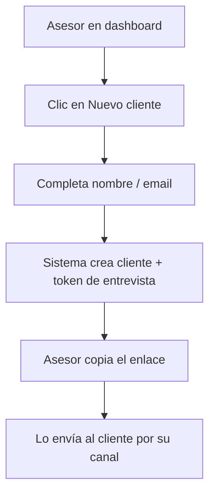
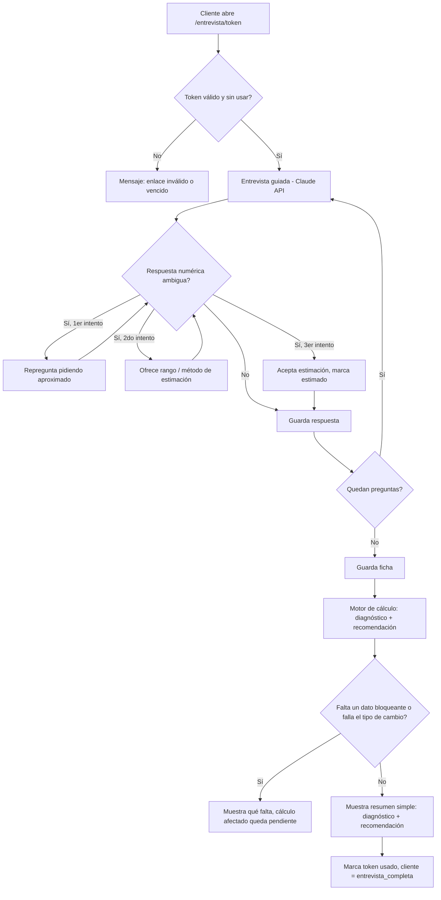
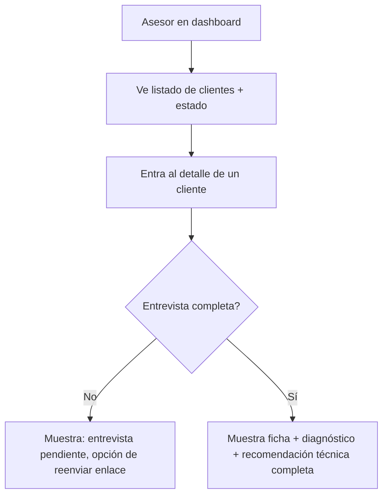

# Flujos de usuario

---

## Convenciones de este documento

Los flujos se documentan con descripción narrativa, diagrama en Mermaid y casos de error. Cada
flujo tiene un ID para referenciarlo desde el PRD o desde el código.

---

## [FLOW-01] — Alta de cliente y generación de enlace

**Actor:** Asesor
**Trigger:** El asesor tiene un cliente nuevo al que quiere entrevistar.
**Resultado esperado:** El cliente queda creado en el dashboard con estado `pendiente` y el
asesor tiene un enlace único para mandarle.

### Pasos

1. El asesor entra al dashboard (autenticado con Supabase Auth) y hace clic en "Nuevo cliente".
2. Completa nombre (y opcionalmente email) del cliente.
3. El sistema crea el registro en `clientes` (estado `pendiente`) y un `entrevista_tokens` con
   vencimiento (ver `data-model.md`).
4. El asesor copia el enlace `/entrevista/[token]` y se lo manda al cliente por el canal que
   prefiera (WhatsApp, email — fuera del sistema).

### Diagrama

### Casos de error

- **Nombre vacío:** el formulario no permite guardar sin nombre.
- **Fallo al generar el token:** se muestra error y se permite reintentar; no queda un cliente
  "huérfano" sin enlace (creación de cliente + token en una sola transacción).

---

## [FLOW-02] — Entrevista y diagnóstico (cliente final)

**Actor:** Cliente final
**Trigger:** El cliente entra al enlace único que le mandó su asesor.
**Resultado esperado:** El cliente completa la entrevista y ve en pantalla, en lenguaje simple,
su diagnóstico y recomendación.

### Pasos

1. El cliente abre `/entrevista/[token]`. El sistema valida que el token exista, no haya
   expirado y no se haya usado antes.
2. Arranca la conversación guiada por la API de Claude, siguiendo el guion de
   `instrucciones-sistema.md`: rompehielos + objetivo → situación vital → objetivo con cifras →
   ingresos/gastos/deudas/ahorro → tolerancia al riesgo. Una pregunta por turno.
3. Si una respuesta numérica es ambigua, el sistema repregunta (hasta 2 veces) antes de aceptar
   una estimación marcada `(estimado)` — nunca inventa un número no dicho.
4. Al cerrar cada bloque, el sistema resume en una frase lo entendido antes de avanzar.
5. Al terminar, el sistema guarda la `ficha`, dispara el cálculo de `diagnóstico` y
   `recomendación` (motor de cálculo), y marca el token como usado (`used_at`) y el cliente como
   `entrevista_completa`.
6. El cliente ve en pantalla el resumen en lenguaje simple: dónde está parado hoy, cuánto
   necesitaría ahorrar, cómo distribuirlo, si la meta es viable y qué opciones hay si no lo es —
   con la aclaración de que es una orientación automática que su asesor revisa después.

### Diagrama

### Casos de error

- **Token inválido, vencido o ya usado:** se muestra un mensaje claro pidiendo que contacte a su
  asesor para un nuevo enlace; no se expone información de otros clientes.
- **Dato faltante o inconsistencia sin resolver:** el cálculo afectado se detiene y se comunica
  en simple ("me falta un dato para poder calcular esto bien: ..."); nunca se estima lo que
  falta.
- **Falla la búsqueda en vivo del tipo de cambio (objetivo en otra moneda):** el cálculo que
  depende de la conversión queda bloqueado y se marca como pendiente, sin usar un valor viejo ni
  estimado (regla de `reglas-recomendacion.md` §6).
- **El cliente abandona a mitad de la entrevista:** las respuestas ya dadas no se pierden (se
  guardan de a poco, no recién al final), pero el cliente sigue en estado `pendiente` hasta
  cerrar la entrevista completa; puede retomar con el mismo enlace mientras no haya expirado.

---

## [FLOW-03] — Revisión del asesor

**Actor:** Asesor
**Trigger:** Quiere ver en qué situación está un cliente (entrevista pendiente o ya completada).
**Resultado esperado:** Ve el listado de sus clientes y, para cualquiera con entrevista
completa, el detalle completo de ficha, diagnóstico y recomendación técnica.

### Pasos

1. El asesor entra al dashboard y ve el listado de clientes con su estado (`pendiente` /
   `entrevista_completa`) y, para los completados, si la meta resultó viable o no.
2. Entra al detalle de un cliente.
3. Ve la ficha completa (con los campos marcados `(estimado)` donde aplique), el diagnóstico
   (situación actual, % del camino recorrido, proyección, gap) y la recomendación técnica
   completa (prioridad aplicada, conversión de moneda si corresponde, aportación, distribución,
   alternativas de viabilidad, supuestos usados) — equivalente a lo que hoy vive en
   `recomendacion-[nombre].md`.

### Diagrama

### Casos de error

- **Cliente sin entrevista completa:** el detalle muestra que está pendiente, sin datos que
  mostrar, con opción de generar un nuevo enlace si el anterior venció.
- **Intento de acceder al cliente de otro asesor:** bloqueado por RLS (`data-model.md` →
  Políticas de acceso); el dashboard no debería ni ofrecer esa navegación.
